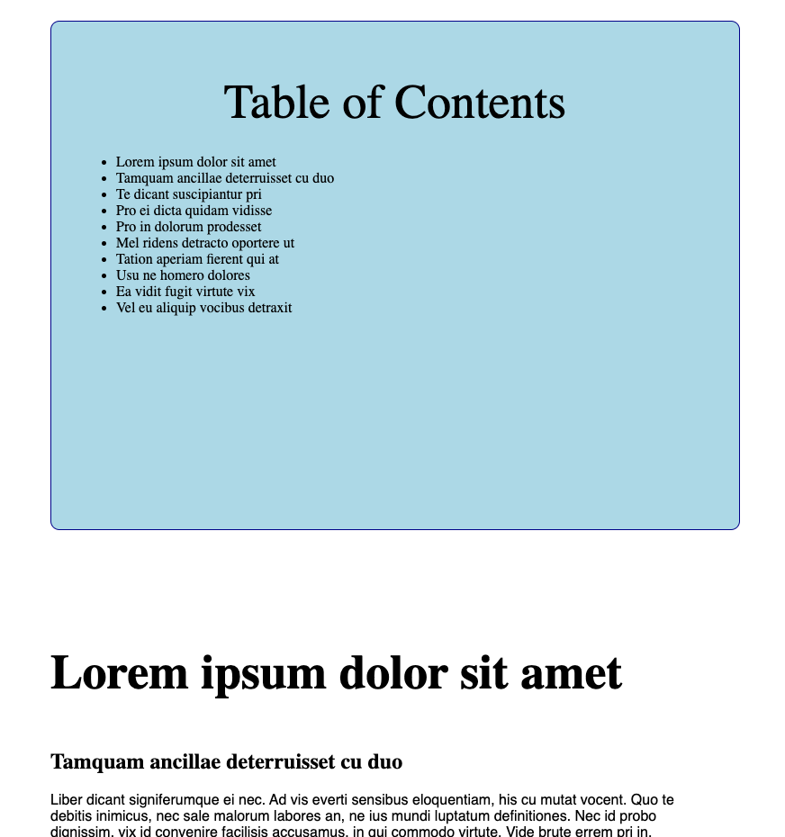

# JS DOM Table of Contents

## Set Up

1. Fork this repo and clone it down to your `sei/homework` folder.
2. Navigate into the directory and open the `index.html` file with Live Server in your browser window to see your DOM updates.
3. Follow the directions below. Remember to make frequent commits with descriptive messages. When finished, submit your work via a pull request.
4. Unless otherwise specified, homework is due the next day at 10:00 AM EST.

## Instructions

You will see that your `index.html` file contains a LOT of text, with `h1`, `h2`, and `p` tags.

Your goal is to use JavaScript only via DOM Manipulation to create a Table of Contents!

Get every `h1` and `h2` from the HTML file and create a list `li` item inside of the `aside` element for every title.

All your HTML for the Table of Contents in the `aside` element must be generated (created) with JavaScript! I.e., do not hard-code the heading titles inside your HTML file.

Need a hint?

1. First use a DOM method to retrieve or "get" the h1/h2 elements from the DOM by their class name.
2. Then think about how you would use DOM manipulation to add the inner text of those headers to the `aside` element. Hint: Try console.logging your DOM variables to see what is being retrieved!
3. Remember that your Table of Contents should be created from DOM methods inside your `script.js` file, and that you should not directly edit your `index.html` file.
4. **BIG HINT**: Read documentation on creating and appending nodes [here](https://www.w3schools.com/jsref/met_node_appendchild.asp). Focus on using the `createElement` and `appendChild` methods to create a `li`, set its inner text to the heading title, and append it to the right parent element.

## Bonus Options

-   [ ] Write a `for loop` or use an array method to iterate over the headers collection array and algorithmically generate the Table of Contents (if you manually hard-coded them).
-   [ ] Add a "Table of Contents" `h1` element to the `aside` element using DOM manipulation.
-   [ ] Modify the Table of Contents, either via the HTML file or DOM manipulation, to contain jump links in the Table of Contents listings that link the user to that section of the page. (Hint: think about how you might be able to create and use an `a` tag and set its `href` attribute. Try to do this via DOM manipulation only, but if needed to complete this step feel free to tweak the HTML.)
-   [ ] Add more styles to your `style.css` file to make your Table of Contents look more polished! Check out the MDN [documentation](https://developer.mozilla.org/en-US/docs/Web/API/HTMLElement/style) on setting inline styles via DOM Manipulation.

## Further Reading & Practice

-   Another [assignment](https://git.generalassemb.ly/seir-129/js-dom-GOT-fanpage) to practice your DOM manipulation and event listener SKILLZ.

-   Khan Academy has a tutorial and quiz on [DOM](https://www.khanacademy.org/computing/computer-programming/html-css-js/js-and-the-dom/pt/the-dom-document-object-model).
